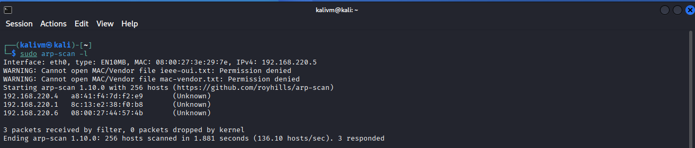
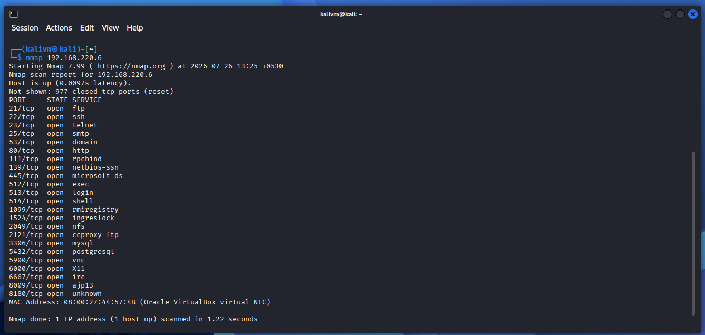
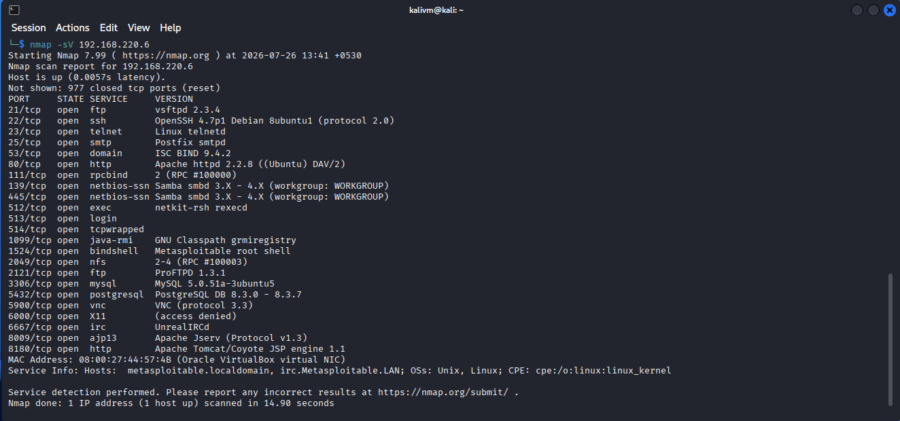
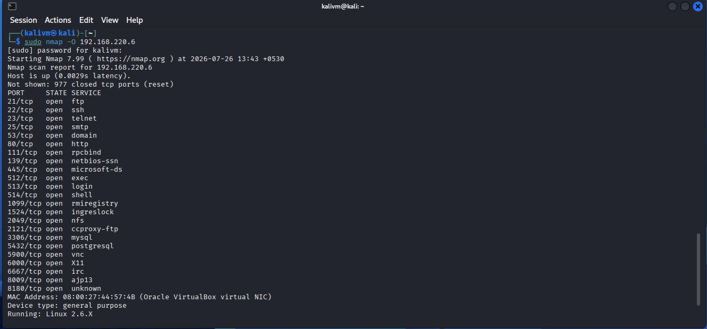
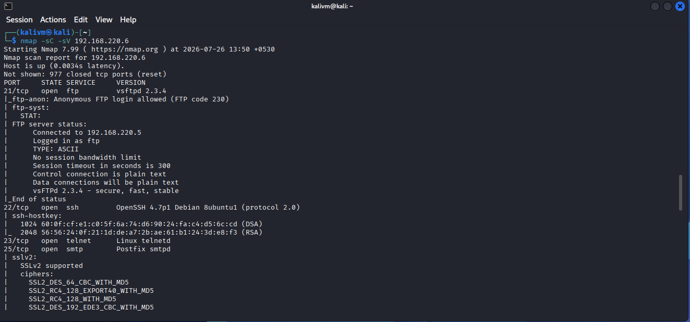
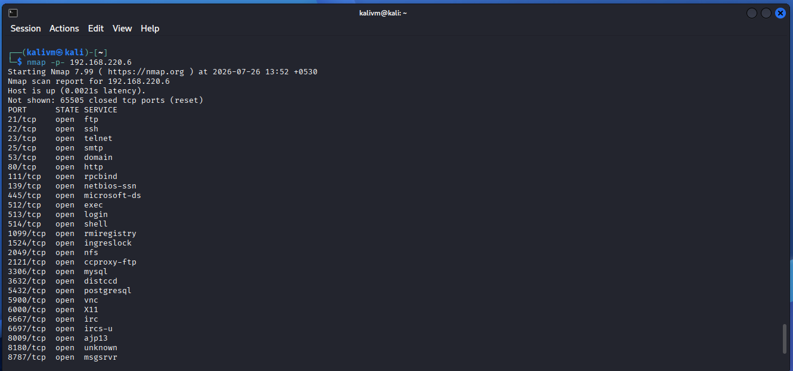
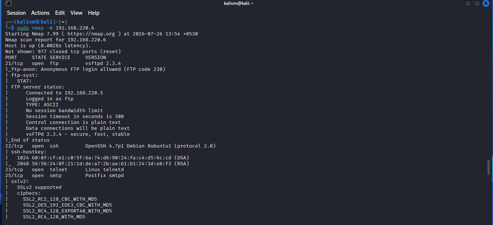

# Nmap Network Reconnaissance Lab

## Objective

Perform a structured network reconnaissance exercise against an intentionally vulnerable target, simulating the initial recon phase of a security assessment. The goal was to move from host discovery, through port/service enumeration, to identifying real, citable vulnerabilities — and to interpret each finding from a defender's perspective rather than just listing raw command output.

## Lab Environment

| Component | Details |
|---|---|
| Attacker machine | Kali Linux (VirtualBox VM) |
| Target machine | Metasploitable2 (VirtualBox VM) |
| Network mode | Host-only / Internal Network (isolated from the host LAN for safety, since Metasploitable2 is intentionally vulnerable) |
| Target IP | 192.168.220.6 |
| Attacker IP | 192.168.220.5 |

> Networking note: an isolated network mode was deliberately chosen over bridged networking, since Metasploitable2's exposed, unpatched services would otherwise be reachable by any other device on the same LAN.

---

## Methodology

### Step 1: Host Discovery (ARP Scan)

**Command:**
```
sudo arp-scan -l
```

**Output:**
```
Interface: eth0, type: EN10MB, MAC: 08:00:27:3e:29:7e, IPv4: 192.168.220.5
192.168.220.4   a8:41:f4:7d:f2:e9       (Unknown)
192.168.220.1   8c:13:e2:38:f0:b8       (Unknown)
192.168.220.6   08:00:27:44:57:4b       (Unknown)
3 packets received by filter, 0 packets dropped by kernel
```

**Screenshot:**


**Findings:**
ARP scanning was used instead of ICMP-based discovery to identify live hosts on the local subnet, since ARP operates at Layer 2 and is faster and more reliable within a single broadcast domain. The target was identified by filtering for the MAC OUI prefix `08:00:27`, which is registered to Oracle VirtualBox — distinguishing the Metasploitable2 VM (`192.168.220.6`) from the attacker host and the network gateway.

---

### Step 2: Basic Port Scan

**Command:**
```
nmap 192.168.220.6
```

**Output:**
```
PORT     STATE SERVICE
21/tcp   open  ftp
22/tcp   open  ssh
23/tcp   open  telnet
25/tcp   open  smtp
53/tcp   open  domain
80/tcp   open  http
111/tcp  open  rpcbind
139/tcp  open  netbios-ssn
445/tcp  open  microsoft-ds
512/tcp  open  exec
513/tcp  open  login
514/tcp  open  shell
1099/tcp open  rmiregistry
1524/tcp open  ingreslock
2049/tcp open  nfs
2121/tcp open  ccproxy-ftp
3306/tcp open  mysql
5432/tcp open  postgresql
5900/tcp open  vnc
6000/tcp open  X11
6667/tcp open  irc
8009/tcp open  ajp13
8180/tcp open  unknown
```

**Screenshot:**


**Findings:**
23 open ports were identified within the default top-1000 scan range — an unusually high number, indicating a deliberately exposed, misconfigured host rather than a hardened production system.

---

### Step 3: Service and Version Detection

**Command:**
```
nmap -sV 192.168.220.6
```

**Output:**
<details>
<summary>Click to expand full output</summary>

```
PORT     STATE SERVICE     VERSION
21/tcp   open  ftp         vsftpd 2.3.4
22/tcp   open  ssh         OpenSSH 4.7p1 Debian 8ubuntu1 (protocol 2.0)
23/tcp   open  telnet      Linux telnetd
25/tcp   open  smtp        Postfix smtpd
53/tcp   open  domain      ISC BIND 9.4.2
80/tcp   open  http        Apache httpd 2.2.8 ((Ubuntu) DAV/2)
111/tcp  open  rpcbind     2 (RPC #100000)
139/tcp  open  netbios-ssn Samba smbd 3.X - 4.X (workgroup: WORKGROUP)
445/tcp  open  netbios-ssn Samba smbd 3.X - 4.X (workgroup: WORKGROUP)
512/tcp  open  exec        netkit-rsh rexecd
513/tcp  open  login
514/tcp  open  tcpwrapped
1099/tcp open  java-rmi    GNU Classpath grmiregistry
1524/tcp open  bindshell   Metasploitable root shell
2049/tcp open  nfs         2-4 (RPC #100003)
2121/tcp open  ftp         ProFTPD 1.3.1
3306/tcp open  mysql       MySQL 5.0.51a-3ubuntu5
5432/tcp open  postgresql  PostgreSQL DB 8.3.0 - 8.3.7
5900/tcp open  vnc         VNC (protocol 3.3)
6000/tcp open  X11         (access denied)
6667/tcp open  irc         UnrealIRCd
8009/tcp open  ajp13       Apache Jserv (Protocol v1.3)
8180/tcp open  http        Apache Tomcat/Coyote JSP engine 1.1
Service Info: Hosts: metasploitable.localdomain, irc.Metasploitable.LAN; OSs: Unix, Linux
```

</details>

**Screenshot:**


**Findings:**

| Port | Service | Risk |
|---|---|---|
| 21 | vsftpd 2.3.4 | Contains a known backdoor (CVE-2011-2523) triggerable via a crafted username, granting unauthenticated root access |
| 1524 | "Metasploitable root shell" | Nmap directly identifies this as an open bindshell — a root shell with no authentication required |
| 6667 | UnrealIRCd | Version fingerprint later confirmed as 3.2.8.1, which contains a known backdoor (CVE-2010-2075) |
| 5900 | VNC protocol 3.3 | A legacy VNC protocol version historically susceptible to authentication bypass |
| 8180 | Apache Tomcat/Coyote 1.1 | Old Tomcat versions are commonly vulnerable to default-credential and manager-app exploitation |

---

### Step 4: OS Detection

**Command:**
```
sudo nmap -O 192.168.220.6
```

**Output:**
```
Device type: general purpose
Running: Linux 2.6.X
OS CPE: cpe:/o:linux:linux_kernel:2.6
OS details: Linux 2.6.9 - 2.6.33
Network Distance: 1 hop
```

**Screenshot:**


**Findings:**
The target's kernel fingerprinted as Linux 2.6.9–2.6.33, consistent with Metasploitable2's actual base (Ubuntu 8.04, released 2008). This OS reached end-of-life years ago, meaning every exposed service above is running on an unsupported, unpatched foundation — compounding the risk of each individual finding.

---

### Step 5: Default Script Scan (NSE)

**Command:**
```
nmap -sC -sV 192.168.220.6
```

**Output:**
<details>
<summary>Click to expand full output</summary>

```
21/tcp   open  ftp         vsftpd 2.3.4
|_ftp-anon: Anonymous FTP login allowed (FTP code 230)
22/tcp   open  ssh         OpenSSH 4.7p1 Debian 8ubuntu1 (protocol 2.0)
25/tcp   open  smtp        Postfix smtpd
| sslv2: SSLv2 supported
| ssl-cert: Subject: commonName=ubuntu804-base.localdomain
| Not valid before: 2010-03-17T14:07:45
|_Not valid after:  2010-04-16T14:07:45
53/tcp   open  domain      ISC BIND 9.4.2
80/tcp   open  http        Apache httpd 2.2.8 ((Ubuntu) DAV/2)
111/tcp  open  rpcbind     2 (RPC #100000)
| rpcinfo:
|   100003  2,3,4       2049/tcp   nfs
|   100005  1,2,3      44242/tcp   mountd
|   100021  1,3,4      52895/tcp   nlockmgr
|   100024  1          43813/tcp   status
139/tcp  open  netbios-ssn Samba smbd 3.X - 4.X (workgroup: WORKGROUP)
445/tcp  open  netbios-ssn Samba smbd 3.0.20-Debian (workgroup: WORKGROUP)
3306/tcp open  mysql       MySQL 5.0.51a-3ubuntu5
5432/tcp open  postgresql  PostgreSQL DB 8.3.0 - 8.3.7
| ssl-cert: Not valid after: 2010-04-16T14:07:45
5900/tcp open  vnc         VNC (protocol 3.3)
6667/tcp open  irc         UnrealIRCd
|   version: Unreal3.2.8.1. irc.Metasploitable.LAN
8180/tcp open  http        Apache Tomcat/Coyote JSP engine 1.1
Host script results:
| smb-security-mode:
|   account_used: guest
|_  message_signing: disabled (dangerous, but default)
| smb-os-discovery:
|   OS: Unix (Samba 3.0.20-Debian)
|   Computer name: metasploitable
|_  FQDN: metasploitable.localdomain
```

</details>

**Screenshot:**


**Findings:**
The default script scan surfaced several high-risk misconfigurations beyond simple open ports:

- **Anonymous FTP login permitted** (`ftp-anon`) — unauthenticated access to the FTP service
- **SMB message signing disabled**, explicitly flagged by Nmap as "dangerous," exposing the service to relay-based man-in-the-middle attacks
- **UnrealIRCd fingerprinted as version 3.2.8.1**, the exact version affected by the CVE-2010-2075 backdoor
- **SMTP supporting the deprecated SSLv2 protocol**, alongside an SSL certificate that expired in April 2010 — meaning any "encrypted" session on that service offers no real trust guarantee
- **NFS/RPC services fully enumerable** (mountd, nlockmgr, status), a classic vector for data exposure and lateral movement

---

### Step 6: Full Port Range Scan

**Command:**
```
nmap -p- 192.168.220.6
```

**Output:**
<details>
<summary>Click to expand full output</summary>

```
Not shown: 65505 closed tcp ports (reset)
PORT      STATE SERVICE
21/tcp    open  ftp
22/tcp    open  ssh
23/tcp    open  telnet
25/tcp    open  smtp
53/tcp    open  domain
80/tcp    open  http
111/tcp   open  rpcbind
139/tcp   open  netbios-ssn
445/tcp   open  microsoft-ds
512/tcp   open  exec
513/tcp   open  login
514/tcp   open  shell
1099/tcp  open  rmiregistry
1524/tcp  open  ingreslock
2049/tcp  open  nfs
2121/tcp  open  ccproxy-ftp
3306/tcp  open  mysql
3632/tcp  open  distccd
5432/tcp  open  postgresql
5900/tcp  open  vnc
6000/tcp  open  X11
6667/tcp  open  irc
6697/tcp  open  ircs-u
8009/tcp  open  ajp13
8180/tcp  open  unknown
8787/tcp  open  msgsrvr
43813/tcp open  unknown
44242/tcp open  unknown
52895/tcp open  unknown
57256/tcp open  unknown
Nmap done: 1 IP address (1 host up) scanned in 23.27 seconds
```

</details>

**Screenshot:**


**Findings:**
Scanning the full 65,535-port range revealed **7 additional open ports** not visible in the default top-1000 scan:

- **Port 3632 (distccd)** — a known unauthenticated remote code execution vulnerability (CVE-2004-2687)
- **Port 8787 (msgsrvr)** — Metasploitable2's built-in Metasploit RPC listener
- **Port 6697 (ircs-u)** — SSL/TLS variant of the already-flagged UnrealIRCd service
- Four high dynamic ports corresponding to RPC services (mountd, nlockmgr, status) already identified via `rpcinfo`

This demonstrates why relying on default top-port scans alone can cause critical exposed services to be missed during a real assessment.

---

### Step 7: Aggressive Scan (Comprehensive Summary)

**Command:**
```
sudo nmap -A 192.168.220.6
```

**Output:**
<details>
<summary>Click to expand full output</summary>

```
OS details: Linux 2.6.9 - 2.6.33
Network Distance: 1 hop
Service Info: Hosts: metasploitable.localdomain, irc.Metasploitable.LAN; OSs: Unix, Linux

Host script results:
| smb-security-mode:
|   account_used: guest
|_  message_signing: disabled (dangerous, but default)
| smb-os-discovery:
|   OS: Unix (Samba 3.0.20-Debian)
|   Computer name: metasploitable
|_  FQDN: metasploitable.localdomain

TRACEROUTE
HOP RTT     ADDRESS
1   2.76 ms 192.168.220.6

[Full service/version/script results consistent with Steps 3-5 above]
```

</details>

**Screenshot:**


**Findings:**
This combined scan consolidates OS detection, service/version detection, default scripting, and traceroute into a single pass, confirming all prior findings (backdoored services, disabled SMB signing, expired certificates, outdated kernel) in one consistent result set. Network distance of 1 hop confirms the target is on the same local segment as the attacker host, as expected in this lab topology.

---

## Summary of Key Vulnerabilities Identified

| Vulnerability | Port/Service | CVE / Reference |
|---|---|---|
| vsftpd backdoor | 21/ftp | CVE-2011-2523 |
| UnrealIRCd backdoor | 6667/irc | CVE-2010-2075 |
| distccd RCE | 3632/distccd | CVE-2004-2687 |
| Anonymous FTP access | 21/ftp | — |
| SMB signing disabled | 445/microsoft-ds | — |
| Deprecated SSLv2 + expired cert | 25/smtp, 5432/postgresql | — |
| Unauthenticated root bindshell | 1524/bindshell | — |
| End-of-life OS (Linux 2.6.x) | Host-wide | — |

## Conclusion

This lab walked through a complete reconnaissance methodology — host discovery, port enumeration, service/version fingerprinting, OS detection, vulnerability-revealing script scans, full-range port scanning, and a final comprehensive pass — against an intentionally vulnerable host. Beyond simply running Nmap commands, each phase was used to build a defender's-perspective risk picture: identifying specific CVEs, misconfigurations, and end-of-life software that a SOC analyst would prioritize for triage, escalation, or remediation in a real environment.

## Tools Used

- Nmap 7.99
- arp-scan
- Kali Linux
- Metasploitable2 (VirtualBox)
