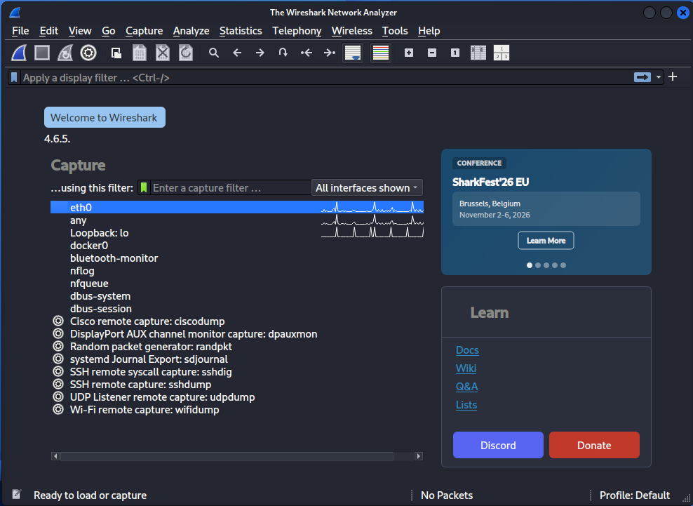
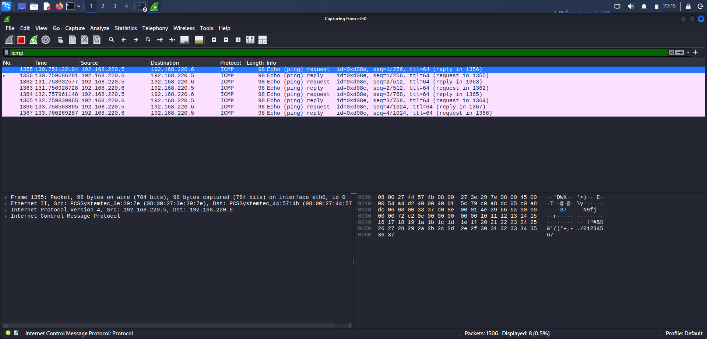
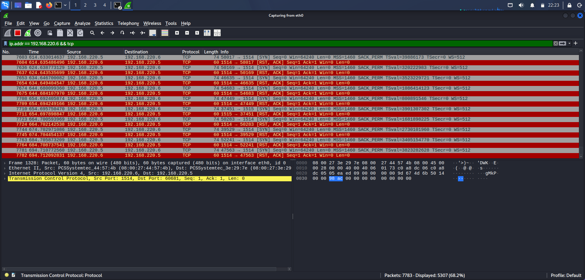
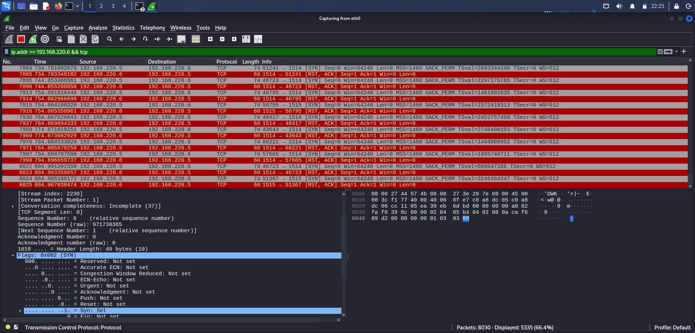
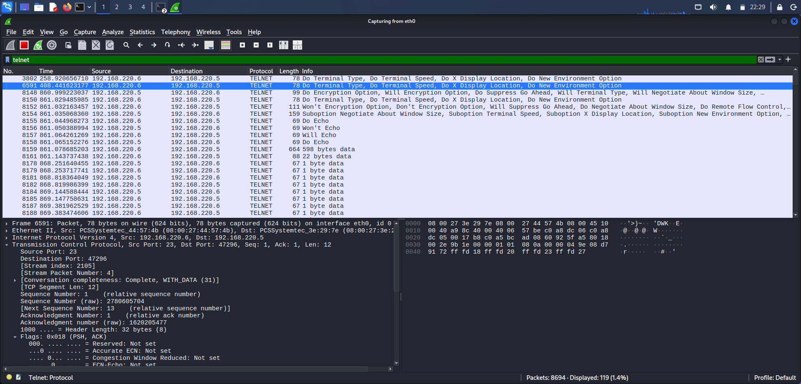
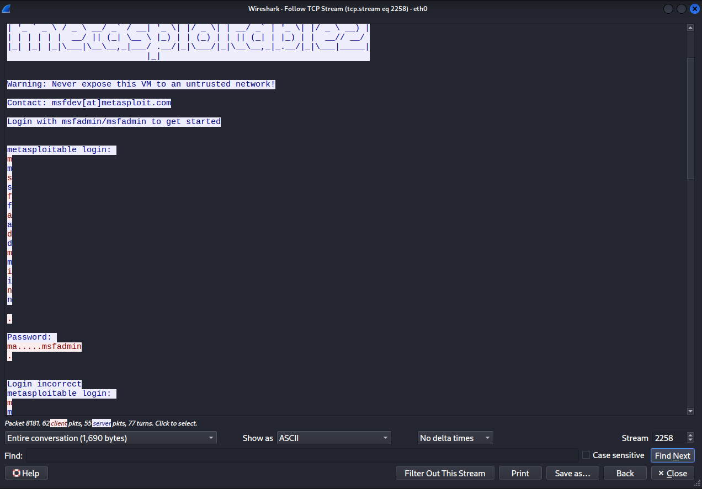
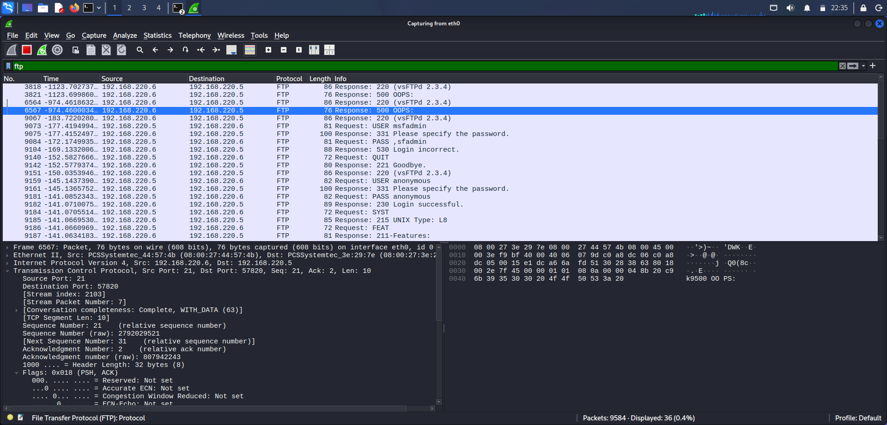
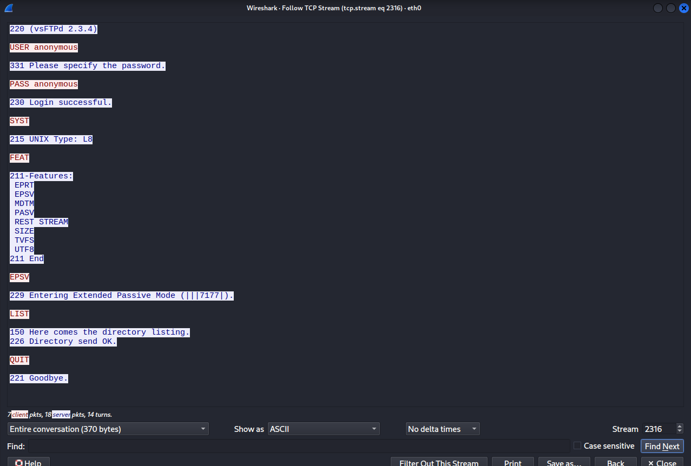
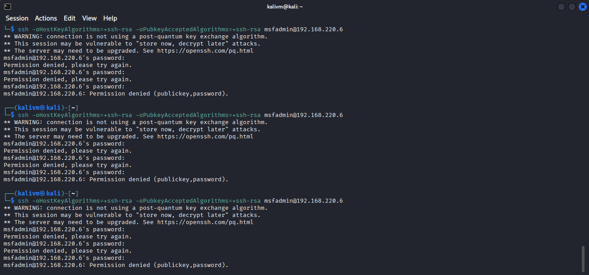
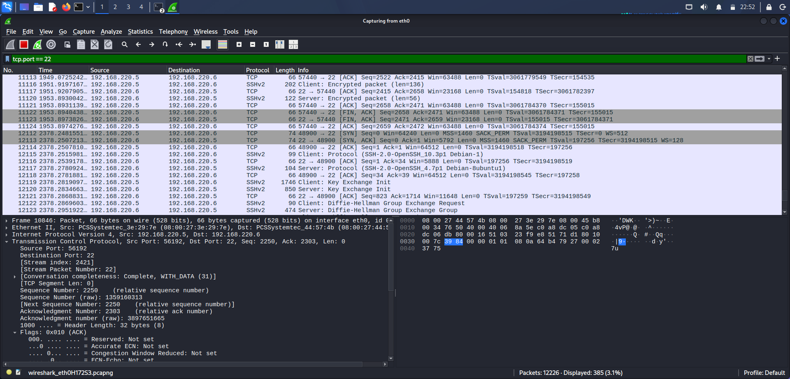

# Network Traffic Analysis Lab (Wireshark)

## Objective

Capture and analyze live network traffic to understand what different types of activity — normal traffic, port scanning, plaintext logins, and repeated failed authentication — actually look like at the packet level. This lab builds directly on the [Nmap Reconnaissance Lab](../01-nmap-recon), using Wireshark to observe and validate several of those earlier findings as real traffic on the wire.

## Lab Environment

| Component | Details |
|---|---|
| Attacker machine | Kali Linux (VirtualBox VM) |
| Target machine | Metasploitable2 (VirtualBox VM) |
| Network mode | Bridged Adapter |
| Target IP | 192.168.220.6 |
| Attacker IP | 192.168.220.5 |
| Capture tool | Wireshark |

---

## Methodology

### Step 1: Interface Setup

Launched Wireshark and identified the active capture interface.

```
sudo wireshark
```

**Screenshot:**


**Findings:**
`eth0` was confirmed as the active interface, matching the interface used throughout the Nmap lab.

---

### Step 2: Baseline Capture (ICMP)

Started a live capture on `eth0`, then generated a known traffic pattern to confirm the capture was working correctly.

**Command (separate terminal):**
```
ping -c 4 192.168.220.6
```

**Wireshark filter:**
```
icmp
```

**Screenshot:**


**Findings:**
Four Echo Request/Reply pairs were observed between the attacker (192.168.220.5) and target (192.168.220.6), confirming the capture setup was functioning correctly before moving to more complex traffic.

---

### Step 3: Capturing an Nmap Scan

Re-ran an earlier scan from the Nmap lab while capturing, to observe what port-scanning traffic looks like at the packet level.

**Command (separate terminal):**
```
nmap -sV 192.168.220.6
```

**Wireshark filter:**
```
ip.addr == 192.168.220.6 && tcp
```

**Screenshot:**




**Findings:**
A rapid burst of `SYN` packets was sent across many destination ports in a short time window, with `SYN-ACK` or `RST-ACK` responses depending on port state. This SYN-flood-like pattern across numerous ports in seconds — rather than a single connection — is a recognizable signature of port scanning activity that a SOC analyst or SIEM would flag for review.

---

### Step 4: Capturing Plaintext Telnet Credentials

Connected to the target via Telnet, an inherently unencrypted protocol, to observe credential exposure at the packet level.

**Command (separate terminal):**
```
telnet 192.168.220.6
```
Logged in using Metasploitable2's default credentials (`msfadmin` / `msfadmin`).

**Wireshark filter:**
```
telnet
```

**Screenshot:**


Right-clicked a Telnet packet → **Follow → TCP Stream** to reconstruct the full session.



**Findings:**
The TCP stream reconstruction revealed the entire Telnet session in plain, readable text — including the username and password exactly as typed. This directly demonstrates why Telnet should never be used to access systems containing sensitive data: any party able to observe network traffic (e.g., via a compromised switch, ARP spoofing, or a tap) can trivially recover credentials.

---

### Step 5: Capturing an Anonymous FTP Login

Connected to the target's FTP service. Only anonymous login was accepted in this environment (`msfadmin`/`msfadmin` was not a valid FTP account), which itself validates the `ftp-anon` finding from the Nmap lab.

**Command (separate terminal):**
```
ftp 192.168.220.6
```
Logged in with username `anonymous`.

**Wireshark filter:**
```
ftp
```

**Screenshot:**


Followed the TCP stream to view the full session.



**Findings:**
The stream showed the `USER anonymous` command followed by a `230 Login successful` response, requiring no valid password. This confirms, at the traffic level, the anonymous-FTP-access finding first identified via Nmap's `ftp-anon` script in the Reconnaissance Lab — demonstrating the same misconfiguration from two different analysis angles.

---

### Step 6: Capturing a Simulated SSH Brute-Force Attempt

Attempted to connect via SSH and deliberately entered incorrect passwords multiple times to simulate a brute-force pattern.

**Connection note:** the default SSH client refused to connect initially, since Metasploitable2's OpenSSH 4.7 only offers deprecated host key types (`ssh-rsa`, `ssh-dss`) that modern clients disable by default. This required explicitly re-enabling the legacy algorithm:
```
ssh -oHostKeyAlgorithms=+ssh-rsa -oPubkeyAcceptedAlgorithms=+ssh-rsa msfadmin@192.168.220.6
```
A host key mismatch warning also appeared, since the target IP had previously been associated with a different key in the local `known_hosts` file — a normal occurrence in a lab environment with reused IPs, resolved with:
```
ssh-keygen -f '/home/kalivm/.ssh/known_hosts' -R '192.168.220.6'
```

**Terminal (failed login attempts):**


**Wireshark filter:**
```
tcp.port == 22
```

**Screenshot:**


**Findings:**
Unlike Telnet and FTP, SSH's encryption meant the actual passwords could not be recovered from the capture. However, the *pattern* of activity was still clearly visible: multiple distinct TCP handshakes to port 22 in a short time window, each followed by a brief encrypted key-exchange, then connection teardown. This repeated connect-fail-disconnect pattern is exactly what a SOC analyst or SIEM correlation rule would use to detect a brute-force attempt, even without visibility into the credentials themselves — illustrating both the value of encryption and the fact that behavioral/traffic-pattern analysis remains possible and necessary even against encrypted protocols.

---

### Step 7: Saved Capture File

The full session was saved as `metasploitable-capture.pcapng` and included in this repository under `captures/`, allowing the complete capture to be reviewed directly in Wireshark rather than relying on screenshots alone.

---

## Summary of Key Findings

| Finding | Protocol/Port | Risk |
|---|---|---|
| Port scan signature (SYN bursts across ports) | TCP (various) | Confirms reconnaissance activity is visible and detectable at the traffic level |
| Plaintext credentials recoverable | Telnet (23) | Full username/password exposed to anyone observing traffic |
| Anonymous FTP access confirmed via traffic | FTP (21) | Validates Nmap's `ftp-anon` finding at the packet level |
| Brute-force connection pattern (behavioral only) | SSH (22) | Credentials protected by encryption, but repeated connection attempts remain visible and detectable |
| Legacy SSH host key algorithms required | SSH (22) | Target runs a deprecated SSH version incompatible with modern client defaults |

## Conclusion

This lab demonstrated how the same underlying activity — a scan, a login, a series of failed attempts — appears very differently on the wire depending on the protocol involved. Plaintext protocols (Telnet, FTP) exposed credentials directly, while SSH's encryption protected credential content but still left a detectable behavioral fingerprint. Together with the Nmap Reconnaissance Lab, this reinforces a core SOC principle: encryption protects *content*, but traffic *patterns* remain a critical detection signal regardless of encryption.

## Tools Used

- Wireshark
- Kali Linux
- Metasploitable2 (Virtual Box)
